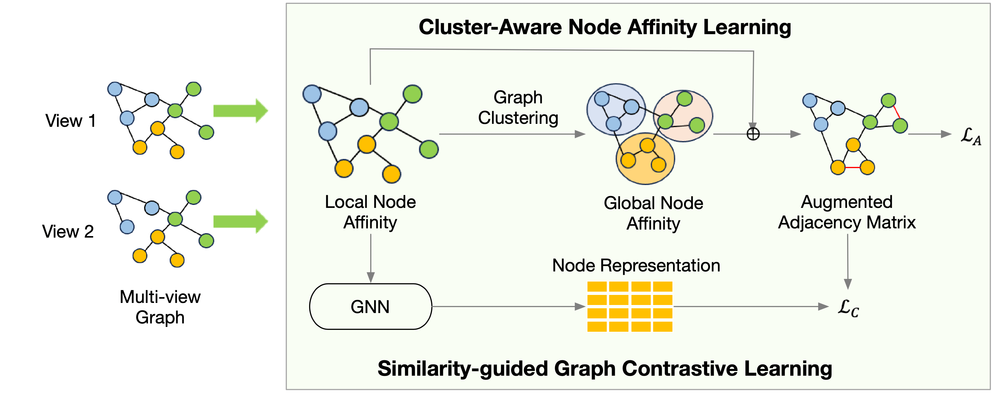

# 🌐 CARE: Cluster-Aware Graph Anomaly Detection (Demo)

> Official demo code for the paper **"Cluster-Aware Graph Anomaly Detection"**  
> This repository provides the implementation and example experiments for reproducing results on benchmark datasets such as **Amazon**, **BlogCatalog**, **IMDB**, and **DBLP**.

---

## 🧠 Overview

**CARE** (Cluster-Aware Graph Anomaly Detection) is designed to detect anomalous nodes in graphs by leveraging both **structural** and **cluster-level semantic information**. The method jointly models **local neighborhood consistency** and **global cluster awareness** to effectively identify anomalies across diverse graph datasets by augmenting the graph adjacency matrix with pseudo-labels derived from soft cluster memberships. 
To mitigate potential bias from these pseudo-labels, CARE introduces a similarity-guided loss, theoretically shown to be a variant of contrastive learning loss connected to spectral clustering.
<div align="center">
    
    <p> CARE Overview</p>
</div>


## ⚙️ Requirements

Before running the demo, please ensure you have the following packages installed:

- [PyTorch](https://pytorch.org/)
- [scikit-learn](https://scikit-learn.org/)
- [scipy](https://scipy.org/)

Install all dependencies with:

```bash
  pip install torch scikit-learn scipy
```

---
## 📦 Dataset Preparation

Before running any experiments, please unzip the dataset archive so the code can access the data files:

```bash
  unzip data.zip
```

This will create a data/ directory (or add files into it) containing the datasets used by the demo, including:
- Amazon
- BlogCatalog
- imdb
- dblp

Make sure the directory structure matches what main.py expects (e.g., data/Amazon/...).

---

## 🚀 Run the Demo

To reproduce the experimental results on each dataset, run:

| **Dataset**   | **Command**                        |
|----------------|------------------------------------|
| Amazon         | `python main.py --dataset Amazon`  |
| BlogCatalog    | `python main.py --dataset BlogCatalog` |
| IMDB           | `python main.py --dataset imdb`    |
| DBLP           | `python main.py --dataset dblp`    |


Each command will run training and evaluation for CARE on the chosen dataset and should save results (check your results/ or logs/ directory if present).


---

## 📊 Experimental Results


CARE demonstrates strong performance on benchmark datasets by capturing both cluster-level and structural anomalies. 

🧩 Results on Multi-View Graphs (CERT, IMDB, DBLP)

| Method      | CERT AUPRC | CERT AUROC | IMDB AUPRC | IMDB AUROC | DBLP AUPRC | DBLP AUROC |
|------------|------------|------------|------------|------------|------------|------------|
| MLRA       | 0.0379 +/- 0.001 | 0.3829 +/- 0.003 | 0.2695 +/- 0.007 | 0.5926 +/- 0.005 | 0.2211 +/- 0.005 | 0.5568 +/- 0.005 |
| NSNMF      | 0.0704 +/- 0.001 | 0.4578 +/- 0.001 | 0.0634 +/- 0.000 | 0.4969 +/- 0.001 | 0.1436 +/- 0.007 | 0.6418 +/- 0.001 |
| NCMOD      | 0.0749 +/- 0.001 | 0.5133 +/- 0.001 | 0.6629 +/- 0.013 | 0.8030 +/- 0.007 | 0.4809 +/- 0.006 | 0.7271 +/- 0.004 |
| SRSLP      | 0.0806 +/- 0.007 | 0.5405 +/- 0.003 | 0.5552 +/- 0.017 | 0.7343 +/- 0.003 | 0.0643 +/- 0.002 | 0.5228 +/- 0.001 |
| TAM        | 0.0771 +/- 0.007 | 0.5400 +/- 0.005 | 0.6521 +/- 0.016 | 0.8233 +/- 0.013 | 0.3466 +/- 0.016 | 0.6690 +/- 0.005 |
| **CARE**   | **0.1198 +/- 0.003** | **0.6056 +/- 0.001** | **0.8968 +/- 0.038** | **0.9370 +/- 0.029** | **0.8495 +/- 0.005** | **0.8696 +/- 0.006** |

🧮 Results on Single-View Graphs (BlogCatalog, Amazon, YelpChi)

| Method      | BlogCatalog AUPRC    | BlogCatalog AUROC | Amazon AUPRC | Amazon AUROC | YelpChi AUPRC | YelpChi AUROC |
|------------|----------------------|------------------|--------------|--------------|---------------|---------------|
| ANOMALOUS  | 0.0652 +/- 0.005     | 0.5652 +/- 0.025 | 0.0558 +/- 0.001 | 0.4457 +/- 0.005 | 0.0519 +/- 0.002 | 0.4956 +/- 0.003 |
| Dominant   | 0.3102 +/- 0.011     | 0.7590 +/- 0.010 | 0.1424 +/- 0.002 | 0.5996 +/- 0.002 | 0.0395 +/- 0.020 | 0.4133 +/- 0.100 |
| CoLA       | 0.3270 +/- 0.000     | 0.7746 +/- 0.009 | 0.0677 +/- 0.001 | 0.5898 +/- 0.011 | 0.0448 +/- 0.002 | 0.4636 +/- 0.001 |
| SLGAD      | 0.3882 +/- 0.007     | 0.8123 +/- 0.002 | 0.0634 +/- 0.005 | 0.5937 +/- 0.005 | 0.0350 +/- 0.000 | 0.3312 +/- 0.035 |
| HCM-A      | 0.3139 +/- 0.001     | 0.7980 +/- 0.004 | 0.0527 +/- 0.015 | 0.3956 +/- 0.014 | 0.0287 +/- 0.012 | 0.4593 +/- 0.005 |
| ComGA      | 0.3293 +/- 0.028     | 0.7683 +/- 0.004 | 0.1153 +/- 0.005 | 0.5895 +/- 0.010 | 0.0423 +/- 0.000 | 0.4391 +/- 0.000 |
| CONAD      | 0.3284 +/- 0.004     | 0.7807 +/- 0.003 | 0.1372 +/- 0.009 | 0.6142 +/- 0.008 | 0.0405 +/- 0.002 | 0.4588 +/- 0.003 |
| TAM        | **0.4182 +/- 0.225** | **0.8248 +/- 0.003** | 0.2634 +/- 0.008 | 0.7064 +/- 0.008 | 0.0778 +/- 0.009 | 0.5643 +/- 0.007 |
| **CARE**   | 0.4043 +/- 0.010     | 0.8194 +/- 0.003 | **0.6563 +/- 0.011** | **0.8656 +/- 0.002** | **0.1218 +/- 0.003** | **0.7516 +/- 0.003** |

[//]: # (![CARE Experimental Results]&#40;Fig/results.png&#41;)

---


## 🧩 Citation

If you use this code or ideas from the paper, please cite:

```
@inproceedings{DBLP:conf/www/ZhengBWZH25,
  author       = {Lecheng Zheng and
                  John R. Birge and
                  Haiyue Wu and
                  Yifang Zhang and
                  Jingrui He},
  editor       = {Guodong Long and
                  Michale Blumestein and
                  Yi Chang and
                  Liane Lewin{-}Eytan and
                  Zi Helen Huang and
                  Elad Yom{-}Tov},
  title        = {Cluster Aware Graph Anomaly Detection},
  booktitle    = {Proceedings of the {ACM} on Web Conference 2025, {WWW} 2025, Sydney,
                  NSW, Australia, 28 April 2025- 2 May 2025},
  pages        = {1771--1782},
  publisher    = {{ACM}},
  year         = {2025},
}
```


